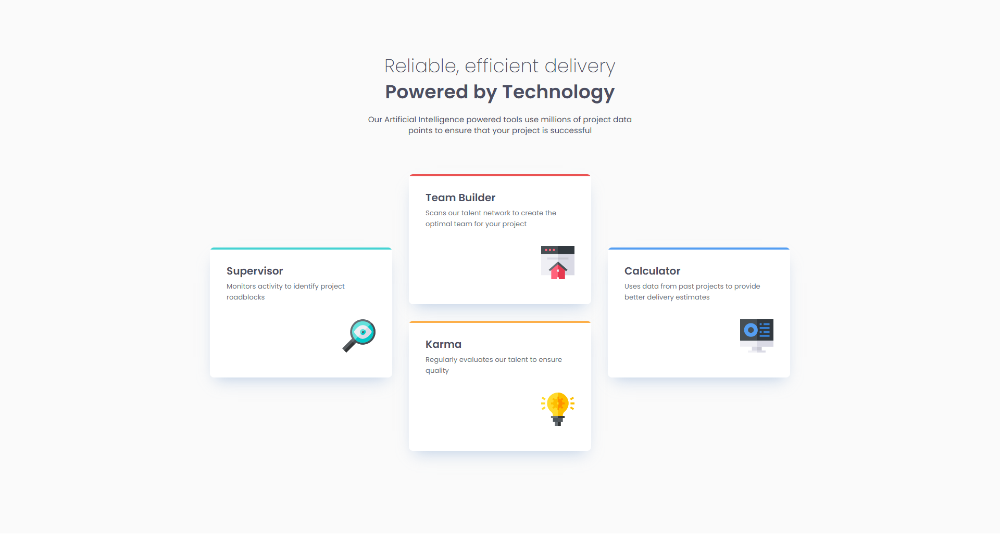
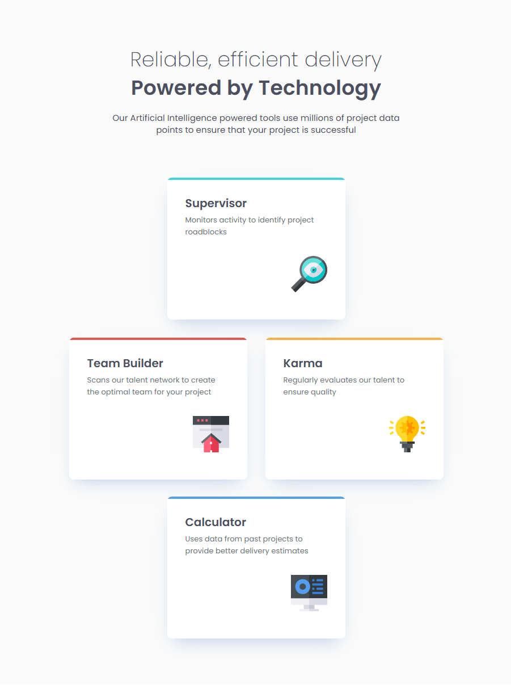
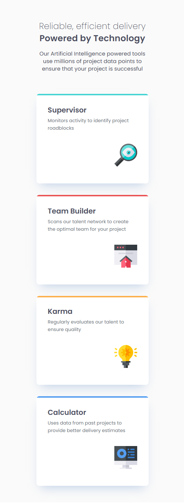

# Frontend Mentor - Four card feature section solution

This is a solution to the [Four card feature section challenge on Frontend Mentor](https://www.frontendmentor.io/challenges/four-card-feature-section-weK1eFYK).

## Table of contents

- [Frontend Mentor - Four card feature section solution](#frontend-mentor---four-card-feature-section-solution)
  - [Table of contents](#table-of-contents)
  - [Overview](#overview)
    - [The challenge](#the-challenge)
    - [Screenshot](#screenshot)
    - [Links](#links)
  - [My process](#my-process)
    - [Built with](#built-with)
    - [What I learned](#what-i-learned)
    - [Continued development](#continued-development)
  - [Author](#author)

## Overview

### The challenge

Users should be able to:

- View the optimal layout for the site depending on their device's screen size

### Screenshot

### Links

- Solution URL: [Solution URL here](https://github.com/FilipKod/four-card-feature-section)
- Live Site URL: [Live site URL here](https://four-card-filipkod.netlify.app/)

## My process

### Built with

- Semantic HTML5 markup
- CSS custom properties
- Flexbox
- CSS Grid
- Mobile-first workflow

### What I learned

Better using css grid for templating.

I use `grid-template-columns` and `grid-template-rows` for ordering cards. Maybe easier solution would be add extra `div` wrapper for second and third card's for better manipulation in css. I choose this solution because I want better understand of templating with grid.

### Continued development

Training more grid templating.

## Author

- LinkedIn - [Filip Madunicky](https://www.linkedin.com/in/madunickyfilip/)
- Frontend Mentor - [@FilipKod](https://www.frontendmentor.io/profile/FilipKod)
- Github - [FilipKod](https://github.com/FilipKod)
